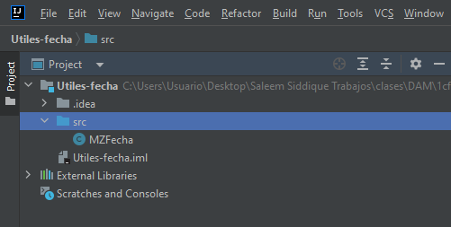
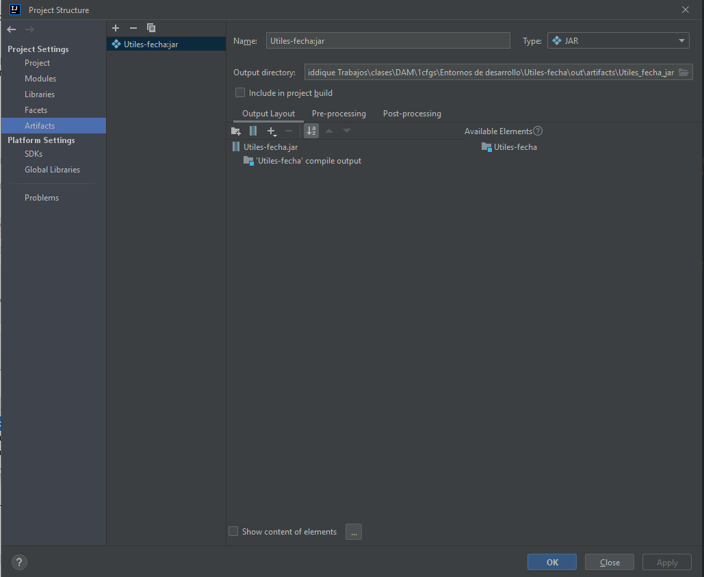
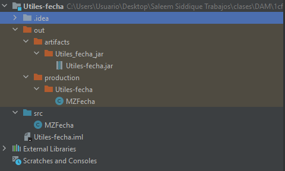
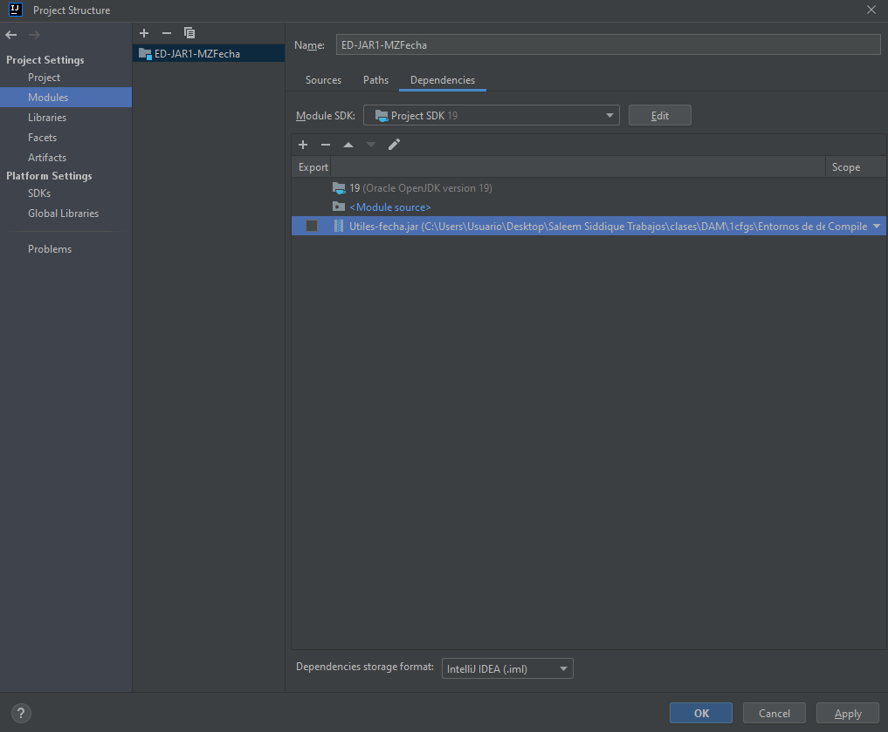
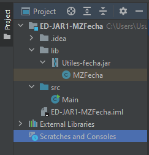
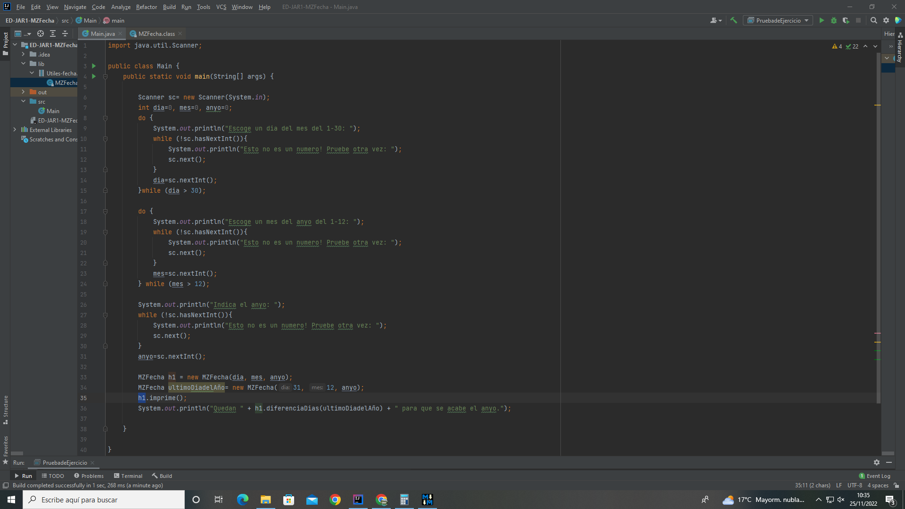
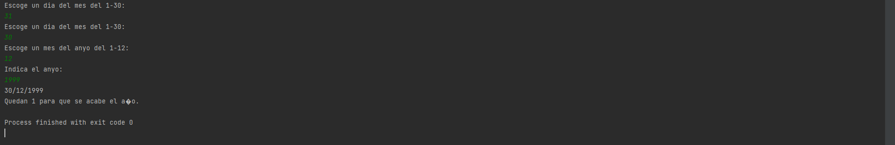

>  Projecto Utiles-fecha creado con MZFecha en src:  

> Creando Archivo JAR:  

> Archivo JAR ya creado en el out:

>  Archivo JAR subido en lib de otro proyecto:  

  

> Comprobacion + Ejercicio creado.  

